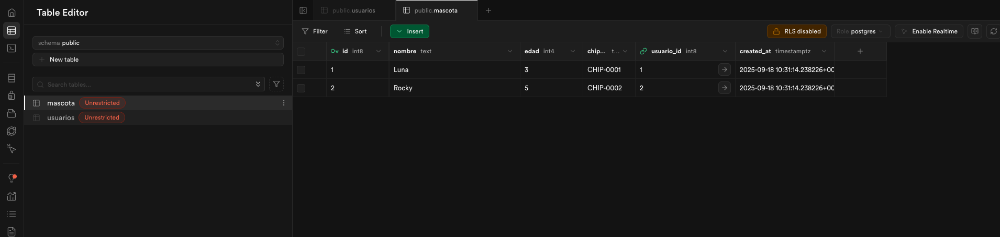
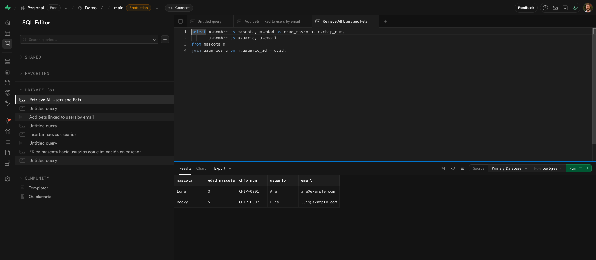

# Supabase - Usuarios & Mascotas 🐶

Este proyecto muestra cómo crear y relacionar dos tablas en **Supabase**:

## 📊 Tablas

1. **usuarios**

   - id (int8, PK)
   - nombre (text)
   - edad (int4)
   - email (text)
   - created_at (timestamp)

2. **mascota**
   - id (int8, PK)
   - nombre (text)
   - edad (int4)
   - chip_num (text)
   - usuario_id (int8, FK → usuarios.id, ON DELETE CASCADE)
   - created_at (timestamp)

## 📸 Capturas de pantalla

### Tabla Usuarios

### Tabla Mascota

### Consulta de Usuarios y Mascotas

## 🚀 Pasos realizados

1. Crear cuenta en Supabase.
2. Crear la tabla `usuarios`.
3. Crear la tabla `mascota` con clave foránea hacia `usuarios(id)`.
4. Insertar registros de prueba.
5. Subir capturas al repositorio.

## 📝 Autor

Ejercicio realizado por **Salvatore Marchese**.
